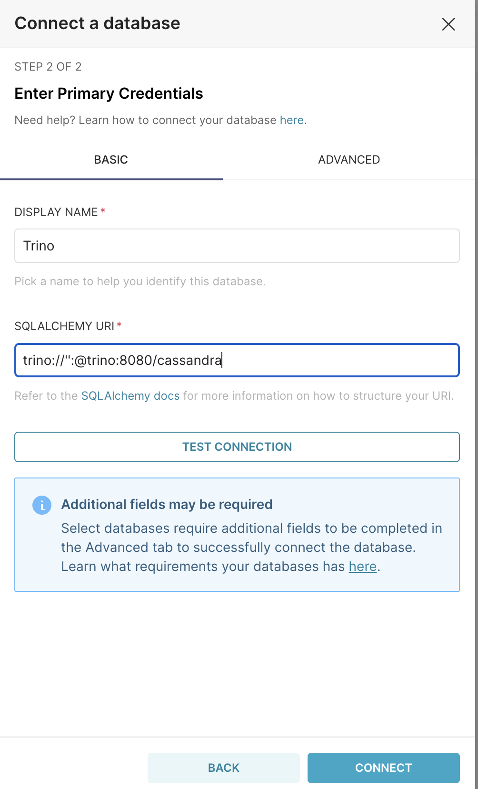
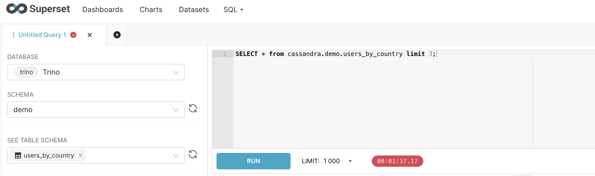

## Cassandra Trino Superset sample project

### Superset

```
docker exec -it superset

superset fab create-admin --username admin --firstname Admin --lastname Admin --email admin@localhost --password admin

superset db upgrade

superset load_examples <-- for extra data

superset init

#error Could not load database driver: TrinoEngineSpec

pip install sqlalchemy-trino
```

### Trino config

```
trino://'':@trino-1:8080/cassaandra
```

### Cassandra

```
create KEYSPACE demo WITH replication = {'class': 'SimpleStrategy', 'replication_factor': 1};

CREATE TABLE demo.users_by_country (
    country text,
    user_email text,
    first_name text,
    last_name text,
    age smallint,
    PRIMARY KEY ((country), user_email)
);


INSERT INTO demo.users_by_country (country,user_email,first_name,last_name,age)
  VALUES('US', 'john@email.com', 'John','Wick',55);

INSERT INTO demo.users_by_country (country,user_email,first_name,last_name,age)
  VALUES('UK', 'peter@email.com', 'Peter','Clark',65);

INSERT INTO demo.users_by_country (country,user_email,first_name,last_name,age)
  VALUES('UK', 'bob@email.com', 'Bob','Sandler',23);

INSERT INTO demo.users_by_country (country,user_email,first_name,last_name,age)
  VALUES('UK', 'alice@email.com', 'Alice','Brown',26);
```

### Setup

#### Superset setup for trino


#### Superset query
